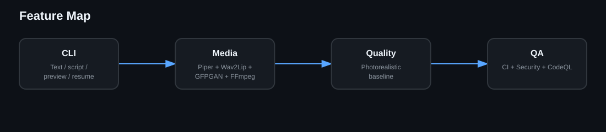
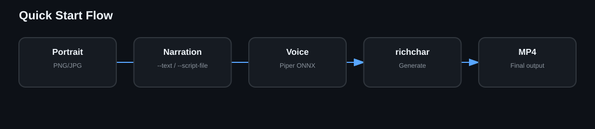
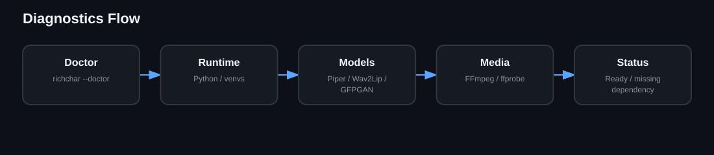
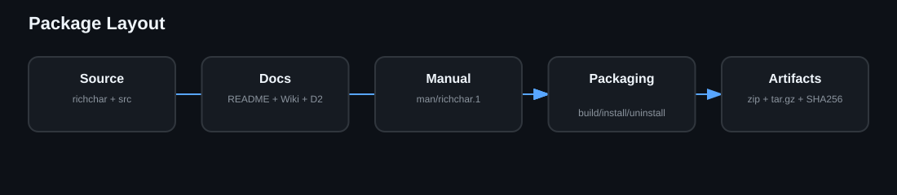
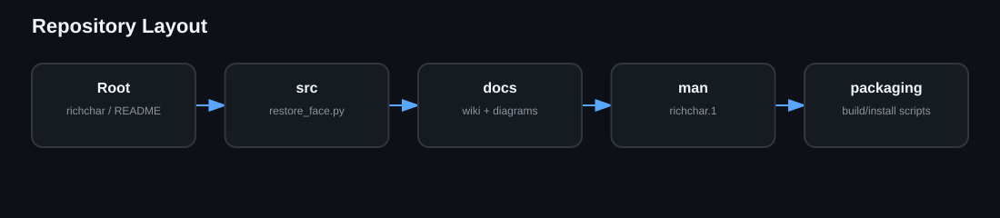

# Richchar CLI

[](https://github.com/iamrichmack111/richchar-cli/actions/workflows/ci.yml)
[](https://github.com/iamrichmack111/richchar-cli/actions/workflows/security.yml)
[](https://github.com/iamrichmack111/richchar-cli/actions/workflows/codeql.yml)
[](https://github.com/iamrichmack111/richchar-cli/releases)


**Richchar CLI** is a local-first talking-portrait generator that orchestrates Piper TTS, Wav2Lip GAN, GFPGAN v1.4 and FFmpeg into a reproducible photorealistic portrait pipeline.

> **Documentation rule:** every major README section has its own D2 source diagram under `docs/diagrams/` and a rendered SVG directly in the section.

## Project Overview


[D2 source](docs/diagrams/overview.d2)

Richchar accepts a portrait, narration and a Piper voice model, then produces a restored H.264 talking-portrait MP4. It is an orchestrator rather than a full nonlinear video editor.

## Features



[D2 source](docs/diagrams/features.d2)

- Local-first generation with no required cloud inference.
- Piper text-to-speech from inline text or script files.
- Wav2Lip GAN lip synchronization with the validated `--nosmooth` path.
- Full-frame lossless PNG extraction and exact GFPGAN v1.4 restoration.
- H.264 final encode using CRF 14 and the slow preset.
- Preview, resume, manual face box and doctor diagnostics.
- CI, Trivy security scanning and CodeQL Python analysis.

## Quick Start



[D2 source](docs/diagrams/quick-start.d2)

```bash
./richchar \
  --image portrait.png \
  --text "Welcome to Richmack OS." \
  --voice-model en_US-ryan-high.onnx \
  --output final.mp4
```

For a text file, replace `--text` with `--script-file narration.txt`.

## Architecture


[D2 source](docs/diagrams/architecture.d2)

The runtime is intentionally staged: Piper generates WAV audio, Wav2Lip GAN creates synchronized motion, FFmpeg extracts every frame losslessly, GFPGAN restores the complete frames, and FFmpeg encodes the final MP4.

## Quality Baseline


[D2 source](docs/diagrams/quality.d2)

The v1.1.0 quality contract is based on the visually validated photorealistic path:

```text
Wav2Lip GAN: --nosmooth
GFPGAN model: GFPGANv1.4.pth
upscale: 1
arch: clean
channel_multiplier: 2
bg_upsampler: None
has_aligned: False
only_center_face: True
paste_back: True
weight: 0.65
FFmpeg codec: libx264
CRF: 14
preset: slow
pixel format: yuv420p
```

See `docs/QUALITY_BASELINE.md` before changing restoration or encoding parameters.

## CLI Reference


[D2 source](docs/diagrams/cli.d2)

Core controls include `--image`, `--text`, `--script-file`, `--voice-model`, `--output`, `--preview-seconds`, `--resume`, `--box`, `--doctor`, and `--help`. The packaged Unix manual provides the long-form reference.

```bash
man ./man/richchar.1
```

## Doctor and Diagnostics



[D2 source](docs/diagrams/doctor.d2)

Run diagnostics before debugging a render:

```bash
./richchar --doctor
```

The doctor checks the expected local toolchain and model/runtime dependencies.

## Performance


[D2 source](docs/diagrams/performance.d2)

GFPGAN is normally the most expensive stage because restoration runs per frame. At 25 FPS, a 20-second clip contains roughly 500 frames. Use short previews before long jobs and use `--resume` after interruptions.

## CI/CD


[D2 source](docs/diagrams/ci-cd.d2)

Every push to `main` and every pull request passes through automated gates. CI checks Bash syntax, ShellCheck, Ruff, Pytest and CLI smoke behavior; Security runs Trivy; CodeQL builds and analyzes a Python database with the full CodeQL bundle.

## Package and Distribution



[D2 source](docs/diagrams/package.d2)

Build release artifacts with:

```bash
./packaging/build-package.sh
```

The package builder emits versioned ZIP and tar.gz archives plus SHA-256 checksums under `dist/`. Installer and uninstaller scripts are included for the CLI and man page.

## Supported Target and Limitations


[D2 source](docs/diagrams/limitations.d2)

The validated target is a photographic human portrait with a visible frontal face and clear mouth. Cartoon and heavily illustrated faces remain experimental/unsupported because face detection and restoration quality are inconsistent on non-photographic input.

## Security


[D2 source](docs/diagrams/security.d2)

Do not commit secrets, generated frame directories, private voice assets, local virtual environments, model checkpoints or large rendered videos unless intentionally distributing them. External tools and models retain their own licenses and usage restrictions.

## Development


[D2 source](docs/diagrams/development.d2)

```bash
python3 -m venv .ci-venv
source .ci-venv/bin/activate
pip install -r requirements-dev.txt
ruff check src tests
pytest -q
shellcheck richchar scripts/doctor.sh packaging/*.sh
```

Changes to the quality baseline should be treated as visual-regression-sensitive changes.

## Release Process


[D2 source](docs/diagrams/release.d2)

A release is cut only after CI, Security and CodeQL are green. Build artifacts, update the changelog, tag the version, push the tag, then verify the GitHub Release artifacts.

## Repository Layout



[D2 source](docs/diagrams/layout.d2)

```text
richchar-cli/
├── richchar
├── src/restore_face.py
├── scripts/doctor.sh
├── tests/
├── docs/
│   ├── diagrams/          # D2 source + rendered SVG for every README section
│   ├── wiki/              # GitHub Wiki mirror
│   └── QUALITY_BASELINE.md
├── man/richchar.1
├── packaging/
├── .github/workflows/
├── README.md
├── CHANGELOG.md
└── LICENSE
```

The wiki mirror contains deeper architecture, installation, troubleshooting, security, CI/CD and release documentation.
