# Richchar CLI

[](https://github.com/iamrichmack111/richchar-cli/actions/workflows/ci.yml)
[](https://github.com/iamrichmack111/richchar-cli/actions/workflows/security.yml)
[](https://github.com/iamrichmack111/richchar-cli/actions/workflows/codeql.yml)


**Richchar CLI** is a local-first talking-portrait generator that orchestrates Piper TTS, Wav2Lip GAN, GFPGAN v1.4, and FFmpeg.

The validated v1.1.0 quality target is **photorealistic human portraits**.

---

## 1. Overview

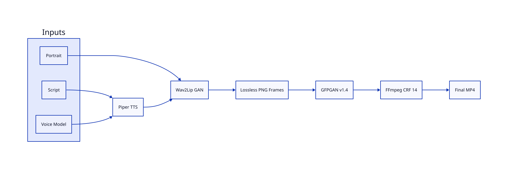

Richchar separates speech generation, lip synchronization, restoration, and encoding into explicit stages.

```text
Portrait + Text
      │
      ▼
    Piper
      │
      ▼
 Wav2Lip GAN
      │
      ▼
   Raw MP4
      │
      ▼
Lossless PNG
      │
      ▼
 GFPGAN 1.4
      │
      ▼
 FFmpeg CRF 14
      │
      ▼
 Final MP4
```

---

## 2. Installation

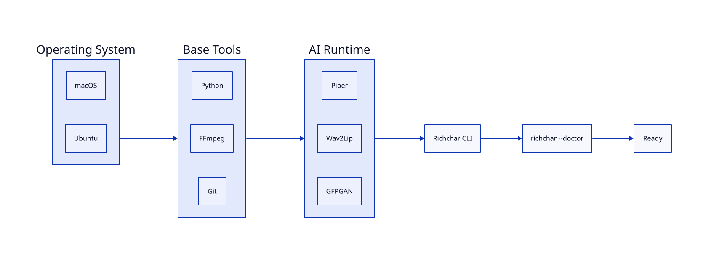

### macOS

Install base tools:

```bash
brew install git ffmpeg python@3.10 d2 groff
```

Clone Richchar:

```bash
git clone git@github.com:iamrichmack111/richchar-cli.git
cd richchar-cli
chmod +x richchar scripts/doctor.sh
```

Create the development environment:

```bash
python3.10 -m venv .venv
source .venv/bin/activate
python -m pip install --upgrade pip
pip install -r requirements-dev.txt
```

Richchar also expects local installations of Piper, Wav2Lip, GFPGAN, FFmpeg, and their required model files.

Run diagnostics:

```bash
./richchar --doctor
```

### Ubuntu

Install base tools:

```bash
sudo apt update
sudo apt install -y git ffmpeg python3 python3-venv python3-pip unzip groff
```

Clone and initialize:

```bash
git clone git@github.com:iamrichmack111/richchar-cli.git
cd richchar-cli
chmod +x richchar scripts/doctor.sh
python3 -m venv .venv
source .venv/bin/activate
python -m pip install --upgrade pip
pip install -r requirements-dev.txt
./richchar --doctor
```

---

## 3. Quick Start

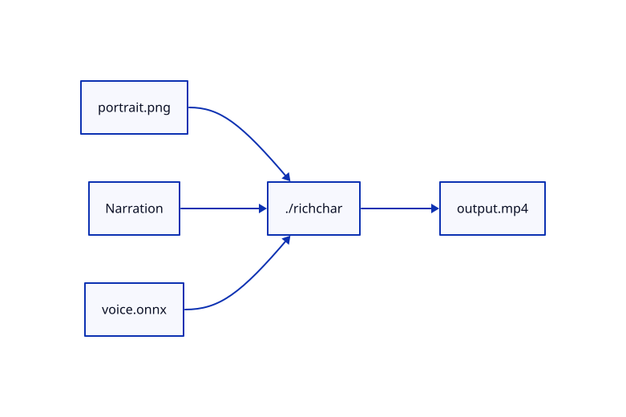

Minimal render:

```bash
./richchar \
  --image portrait.png \
  --text "Welcome to Richmack OS." \
  --voice-model voice.onnx \
  --output output.mp4
```

Using a narration file:

```bash
./richchar \
  --image portrait.png \
  --script-file narration.txt \
  --voice-model voice.onnx \
  --output final.mp4
```

Absolute-path example:

```bash
./richchar \
  --image ~/Desktop/portrait.png \
  --text "This is a Richchar quality test." \
  --voice-model ~/Desktop/en_US-ryan-high.onnx \
  --output ~/Desktop/richchar-test.mp4
```

---

## 4. CLI Commands

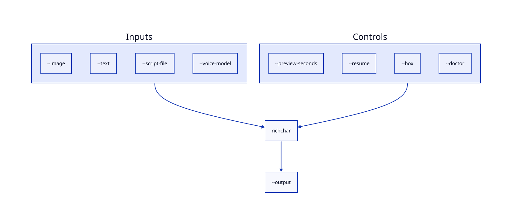

Doctor:

```bash
./richchar --doctor
```

Short preview:

```bash
./richchar \
  --image portrait.png \
  --text "Testing Richchar." \
  --voice-model voice.onnx \
  --preview-seconds 5 \
  --output preview.mp4
```

Resume:

```bash
./richchar \
  --image portrait.png \
  --script-file narration.txt \
  --voice-model voice.onnx \
  --resume \
  --output final.mp4
```

Manual face box:

```bash
./richchar \
  --image portrait.png \
  --text "Testing manual face detection." \
  --voice-model voice.onnx \
  --box 120 980 170 980 \
  --output manual-box.mp4
```

Help:

```bash
./richchar --help
```

---

## 5. Rendering Pipeline

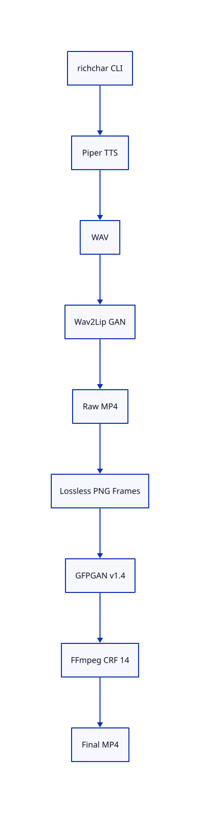

```text
[1/5] Generating Piper audio
[2/5] Running Wav2Lip GAN
[3/5] Extracting lossless PNG frames
[4/5] Running exact GFPGAN restoration
[5/5] Encoding final MP4
```

The lossless PNG stage avoids another lossy encode before restoration.

---

## 6. Quality Baseline

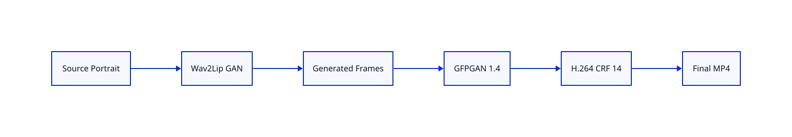

Validated GFPGAN settings:

```text
GFPGANv1.4.pth
upscale=1
arch=clean
channel_multiplier=2
bg_upsampler=None
has_aligned=False
only_center_face=True
paste_back=True
weight=0.65
```

Final encoding:

```text
codec:     libx264
CRF:       14
preset:    slow
pixel fmt: yuv420p
```

Wav2Lip uses the GAN checkpoint with `--nosmooth`.

---

## 7. Components

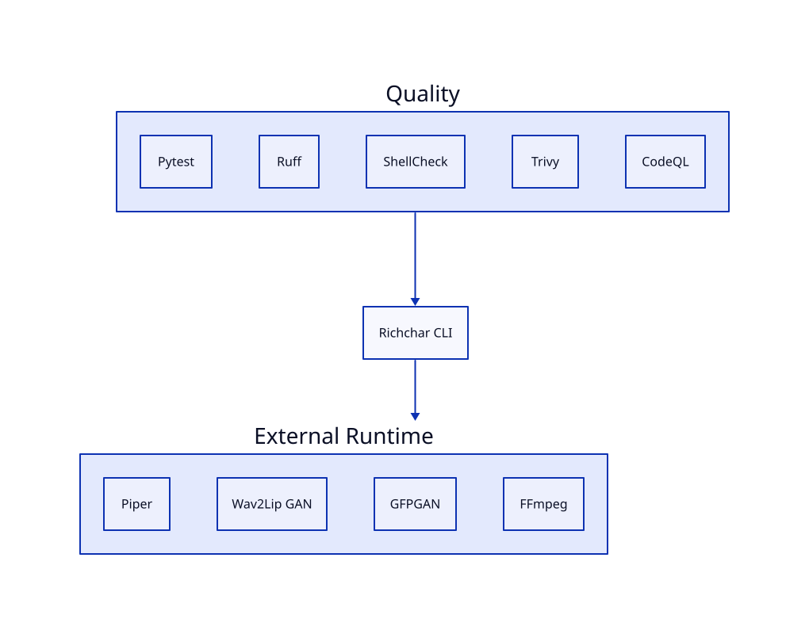

Richchar is an orchestrator around dedicated local runtimes:

```text
richchar
├── Piper
├── Wav2Lip GAN
├── FFmpeg / FFprobe
├── src/restore_face.py
│   └── GFPGAN v1.4
├── scripts/doctor.sh
└── final MP4
```

---

## 8. Performance

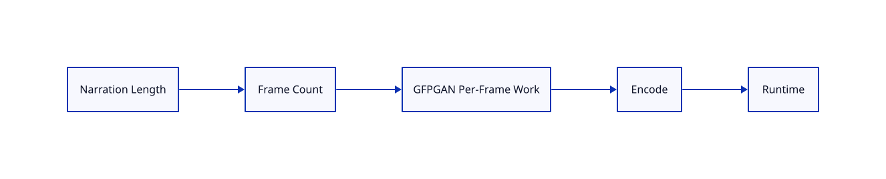

GFPGAN restoration is usually the longest stage because every generated frame is restored individually.

At 25 FPS:

```text
85 frames   ≈ 3.4 seconds
495 frames  ≈ 19.8 seconds
1500 frames ≈ 60 seconds
```

Use short previews before long renders and resume interrupted jobs where possible.

---

## 9. CI/CD and Security

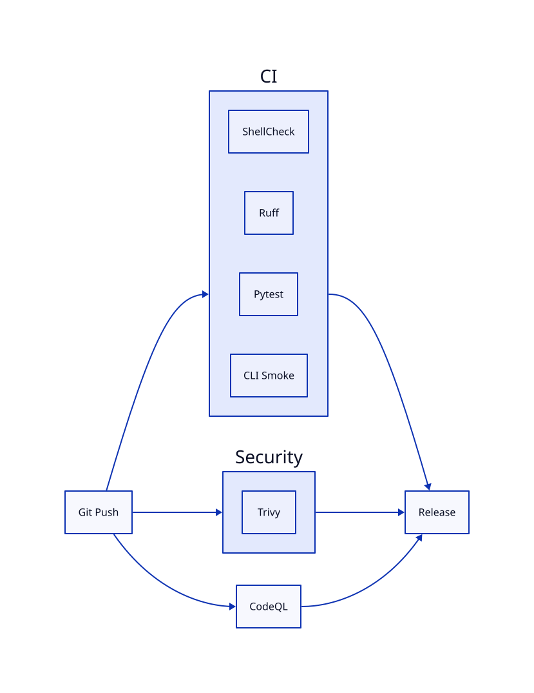

Every push is validated through independent quality and security gates:

```text
Git Push
├── CI
│   ├── Bash syntax
│   ├── ShellCheck
│   ├── Ruff
│   ├── Pytest
│   └── CLI smoke
├── Security
│   └── Trivy
└── CodeQL
    └── Python analysis
```

Check GitHub Actions:

```bash
gh run list -L 10
```

Local checks:

```bash
ruff check src tests
pytest -q
shellcheck richchar scripts/doctor.sh
```

---

## 10. Troubleshooting

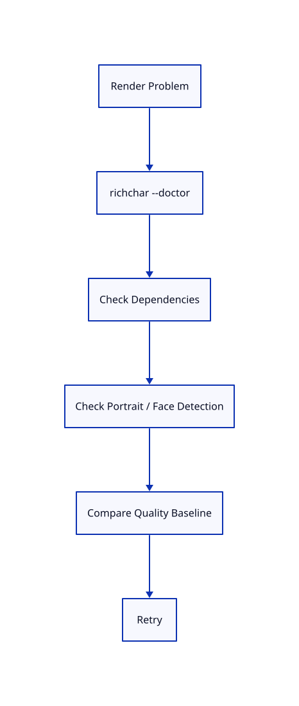

Always start with:

```bash
./richchar --doctor
```

Check media tools:

```bash
ffmpeg -version
ffprobe -version
```

Inspect an output:

```bash
ffprobe output.mp4
```

If automatic detection fails on a suitable photographic portrait, use:

```text
--box TOP BOTTOM LEFT RIGHT
```

---

## 11. Supported Input

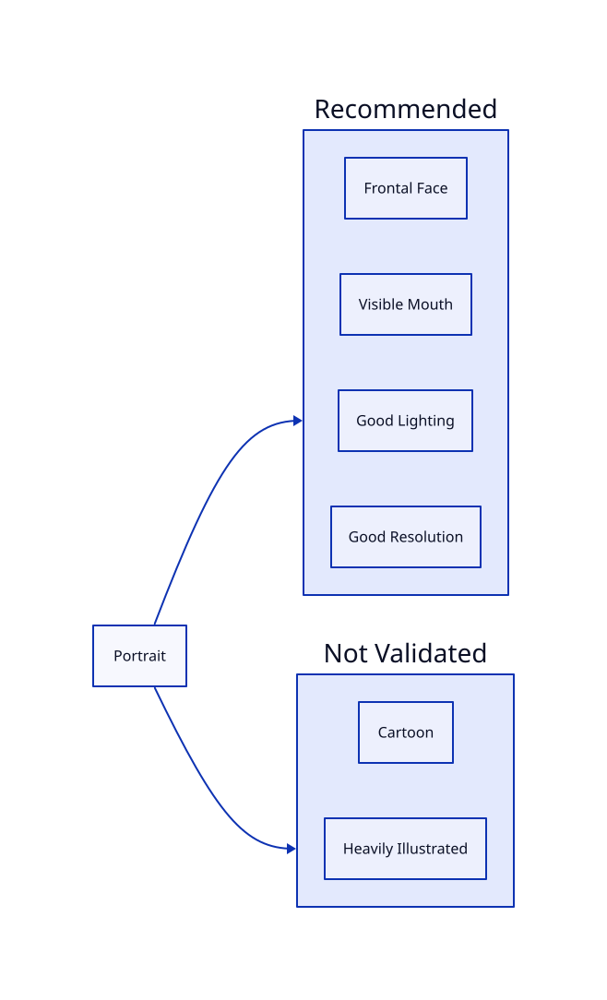

Best results come from photographic portraits with a clear frontal face, visible mouth, good resolution, reasonable lighting, and minimal obstruction.

Cartoon and heavily illustrated faces are **not a validated Richchar v1.1.0 quality target**.

---

## 12. Packaging

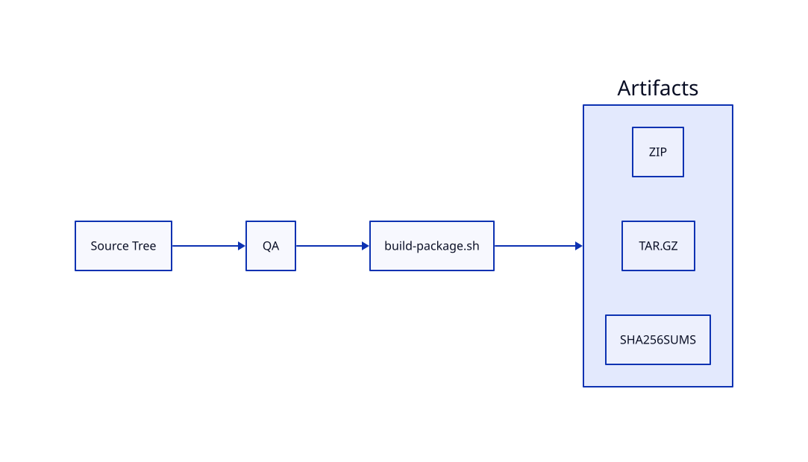

Build distribution artifacts:

```bash
chmod +x packaging/build-package.sh
./packaging/build-package.sh
```

Inspect them:

```bash
ls -lh dist/
```

Expected outputs:

```text
richchar-cli-1.1.0.zip
richchar-cli-1.1.0.tar.gz
SHA256SUMS
```

---

## 13. Man Page

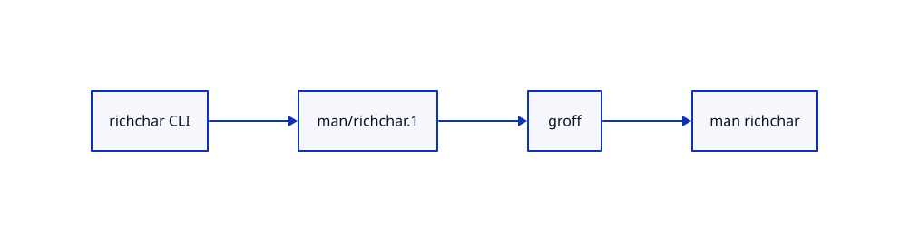

View directly:

```bash
groff -man -Tascii man/richchar.1 | less
```

After installation:

```bash
man richchar
```

---

## 14. Wiki Documentation

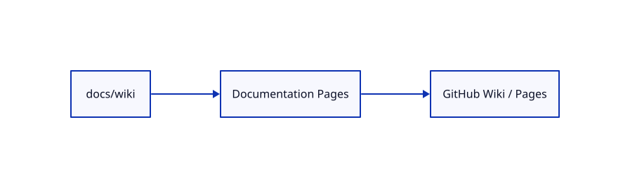

The long-form documentation is mirrored under `docs/wiki/`.

If the GitHub Wiki feature is unavailable for the repository, these pages remain version-controlled and can later be published to GitHub Pages or the Wiki when available.

---

## 15. Development

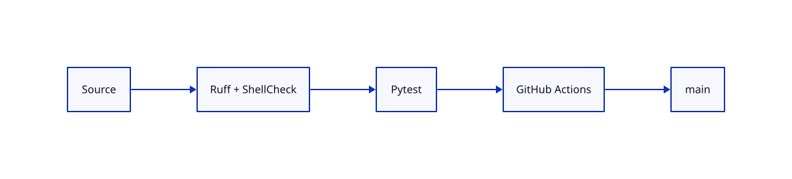

Create a QA environment:

```bash
python3.10 -m venv .ci-venv
source .ci-venv/bin/activate
pip install -r requirements-dev.txt
```

Run QA:

```bash
ruff check src tests
pytest -q
shellcheck richchar scripts/doctor.sh packaging/*.sh
```

---

## 16. Repository Layout

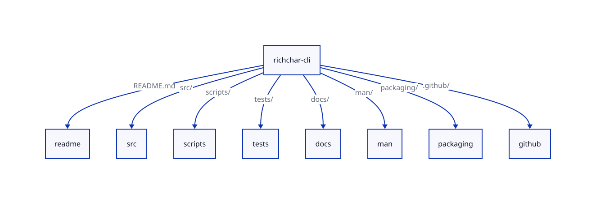

```text
richchar-cli/
├── richchar
├── README.md
├── CHANGELOG.md
├── LICENSE
├── pyproject.toml
├── requirements-dev.txt
├── src/
├── scripts/
├── tests/
├── docs/
│   ├── architecture/
│   └── wiki/
├── man/
├── packaging/
└── .github/
```

---

## 17. Licensing

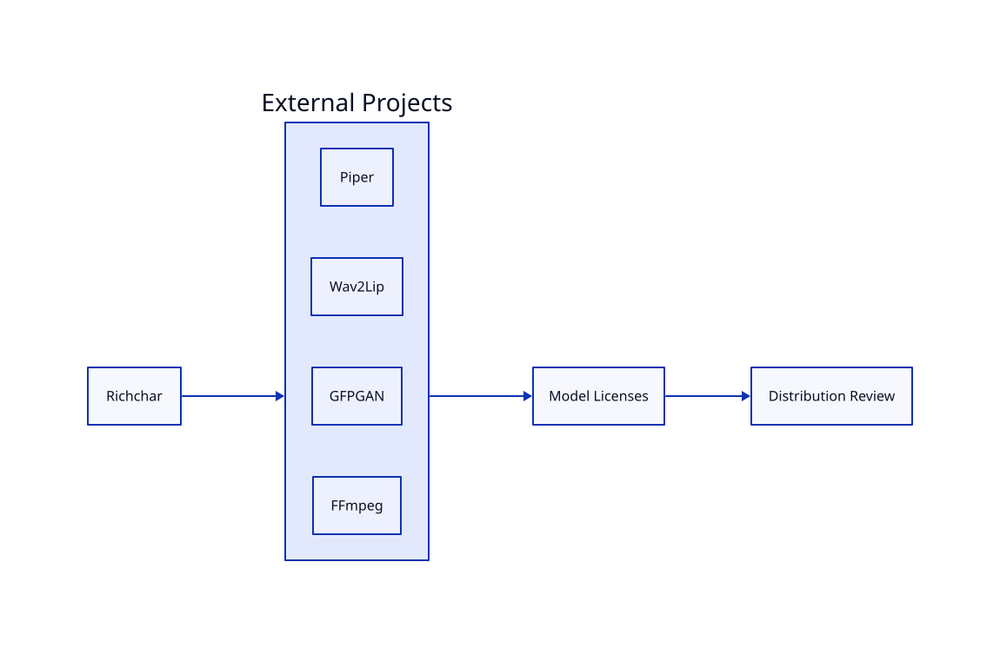

Richchar integrates external software and models. Those projects retain their own licensing requirements.

Before commercial redistribution, verify the licenses that apply to Piper, Piper voice models, Wav2Lip, Wav2Lip checkpoints, GFPGAN, GFPGAN checkpoints, and FFmpeg.

---

**Richchar CLI v1.1.0**
