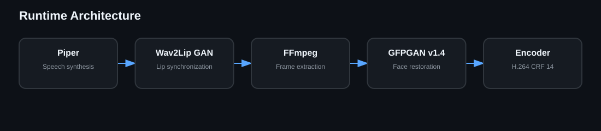

# Architecture

Richchar is a staged orchestrator. Piper creates speech, Wav2Lip GAN produces synchronized facial motion, FFmpeg extracts full lossless frames, GFPGAN v1.4 restores the generated face, and FFmpeg performs the final high-quality encode.

The staged design makes failures observable and keeps the exact validated restoration recipe reproducible.
