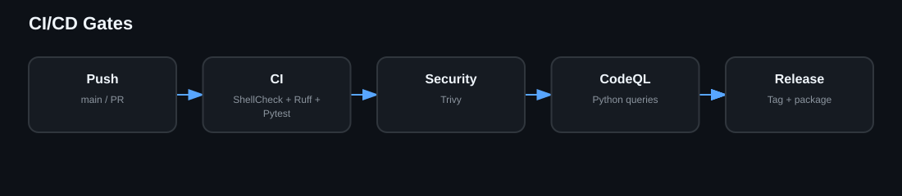

# CI/CD

CI validates Bash syntax, ShellCheck, Ruff, Pytest and CLI smoke behavior. Security runs Trivy. CodeQL uses the full bundle and Python queries without depending on repository SARIF upload. A release should only be cut when all required gates are green.
