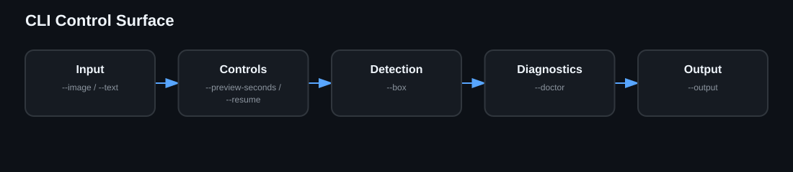

# CLI Reference

Use `./richchar --help` for the live interface and `man ./man/richchar.1` for the packaged manual. Common controls are `--image`, `--text`, `--script-file`, `--voice-model`, `--output`, `--preview-seconds`, `--resume`, `--box`, and `--doctor`.
