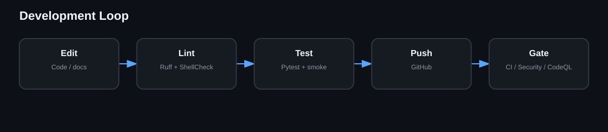

# Development

Use a local QA virtual environment for Ruff and Pytest, run ShellCheck on shell entrypoints, and treat changes to GFPGAN/Wav2Lip/FFmpeg baseline settings as visual-regression-sensitive.
