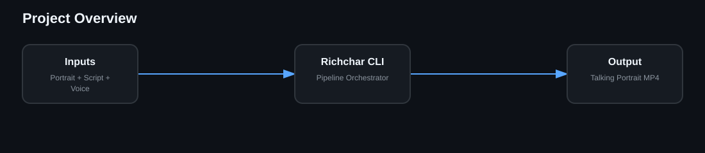

# Richchar CLI Wiki

Richchar is a local-first talking-portrait pipeline. This wiki mirrors the repository documentation so architecture and operations remain version controlled.

## Pages

- [Architecture](Architecture)
- [Rendering Pipeline](Rendering-Pipeline)
- [Quality Baseline](Quality-Baseline)
- [CLI Reference](CLI-Reference)
- [Installation — macOS](Installation-macOS)
- [Installation — Ubuntu](Installation-Ubuntu)
- [Performance](Performance)
- [Troubleshooting](Troubleshooting)
- [Security](Security)
- [CI/CD](CI-CD)
- [Development](Development)
- [Release Process](Release-Process)
- [Known Limitations](Known-Limitations)
