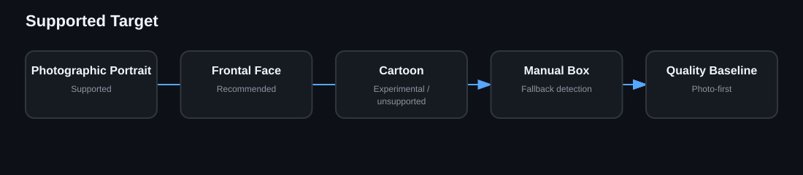

# Known Limitations

The quality target is photorealistic human portraits. Cartoon and heavily illustrated faces are not validated. Full-frame GFPGAN restoration is computationally expensive, and compatibility depends on independently versioned upstream tools/models.
