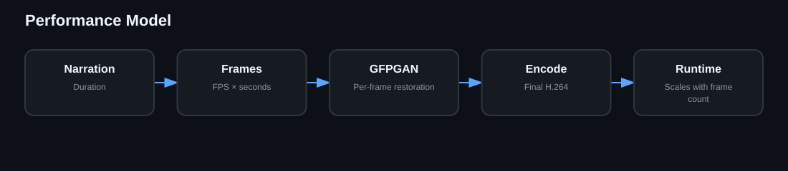

# Performance

Runtime scales mainly with generated frame count because GFPGAN restores every frame. Short previews are the fastest quality check. Resume mode avoids repeating completed expensive work after an interrupted job.
