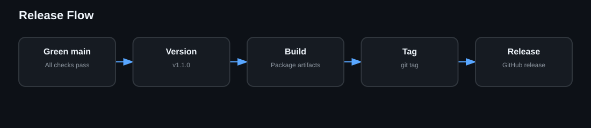

# Release Process

1. Confirm clean working tree.
2. Run local QA.
3. Push main and confirm CI/Security/CodeQL.
4. Build package artifacts.
5. Update changelog.
6. Tag version.
7. Push tag.
8. Verify GitHub Release assets/checksums.
