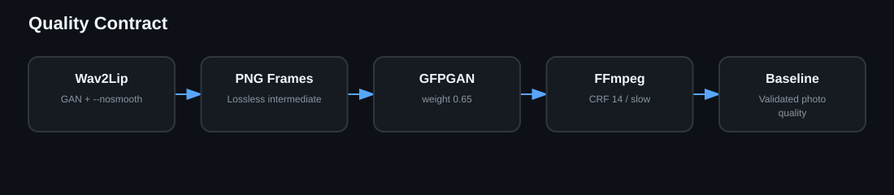

# Rendering Pipeline

1. Validate portrait, narration, voice model and runtime paths.
2. Synthesize WAV audio with Piper.
3. Run Wav2Lip GAN with `--nosmooth`.
4. Extract every frame to PNG.
5. Restore complete frames with GFPGAN v1.4.
6. Reassemble with the source frame rate, H.264 CRF 14 and slow preset.
