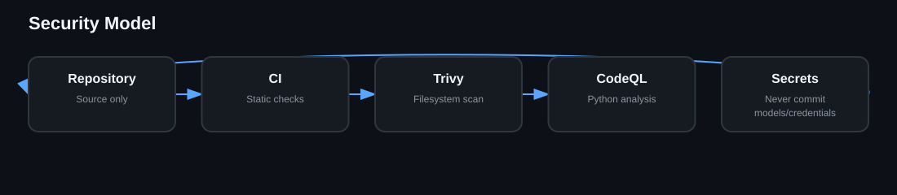

# Security

The repository uses CI, Trivy and CodeQL. Keep credentials, private voice assets, generated frames, model checkpoints, local virtual environments and large outputs out of source control unless intentionally distributed.
